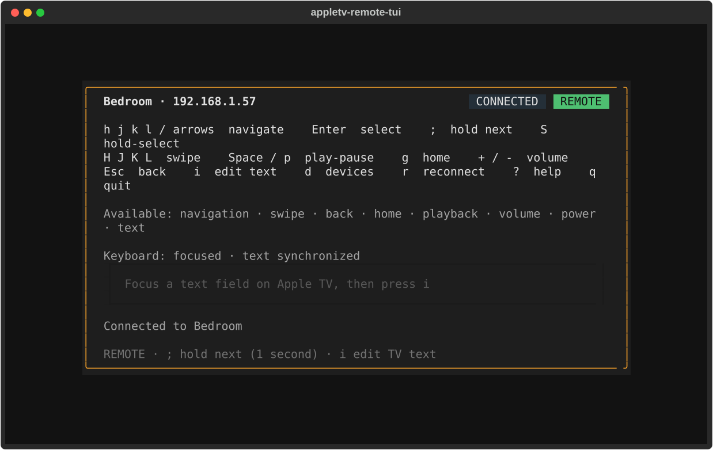
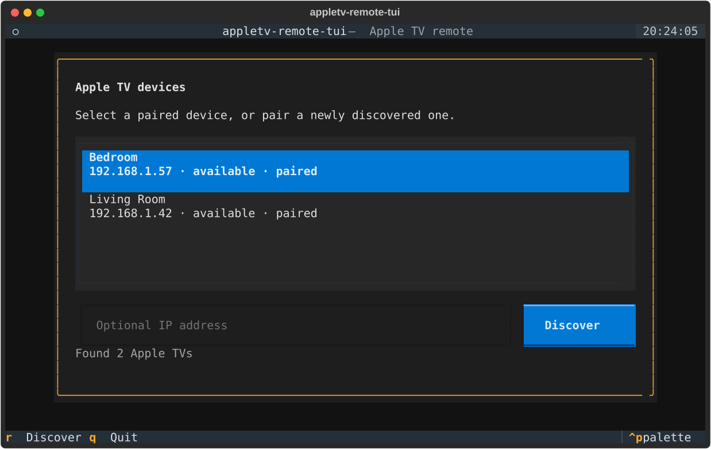
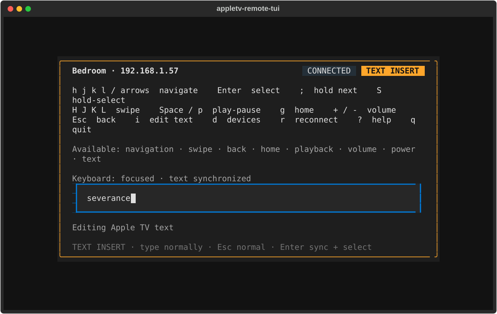

# appletv-remote-tui

A Vim-friendly terminal remote for Apple TV. Navigate tvOS and type or paste
into the text field focused on your television.



<table>
  <tr>
    <td></td>
    <td></td>
  </tr>
</table>

Available under the [MIT License](LICENSE).

## Requirements

- Python 3.11+, a Unicode terminal, and Apple TV HD or Apple TV 4K
- Computer and Apple TV on the same LAN; guest Wi-Fi, VPNs, or firewalls can
  block Bonjour/mDNS discovery

## Install and run

From a checkout, with [`uv`](https://docs.astral.sh/uv/):

```console
uv sync --locked
uv run atv-remote
```

Or install the command from the checkout (all features included; no extras):

```console
uv tool install .
atv-remote
```

If multicast discovery is unavailable, use a known address:

```console
atv-remote --host 192.168.1.42 --scan-timeout 10
```

Select your Apple TV and enter its on-screen PIN when prompted. Credentials are
reused; successfully connected devices appear first on later launches.

## Keys

`REMOTE` controls the TV; `TEXT NORMAL` and `TEXT INSERT` edit a local text buffer.

| Keys in REMOTE | Action |
| --- | --- |
| `h` / `j` / `k` / `l` or arrows | Left / down / up / right |
| `Enter`; `Esc` / `Backspace` | Select; Back/Menu |
| `g`; `Space` / `p` | Home/TV; Play/Pause |
| `H` / `J` / `K` / `L` | Swipe left / down / up / right |
| `;` then a supported key; `S` | Hold that button; hold Select |
| `+` / `-`; `o` / `x` | Volume up/down; power on/off |
| `i`; `d`; `r` | Edit focused text; device picker; reconnect/rediscover |
| `?`; `q` / `Ctrl-C` | Help; quit |

Swipes, volume, and power depend on device capabilities. Swipe directions
refer to finger movement; results depend on the app and view.

### Holds and connection safety

Press `;` then `g` (Home), `Enter` (Select), `h`/`j`/`k`/`l` or an arrow
(direction), or `Backspace` (Menu). `Esc` or another `;` cancels without Back.
The prefix is one-shot and REMOTE-only; unsupported holds fail without a tap.
`S` directly holds Select. Holds last a fixed **one second**, not until physical
key release; keeping a keyboard key down is not a timed hold.

Only one remote command runs at a time: additional remote-command keypresses
are **dropped, not queued**. Quitting drains the accepted operation and transport
cleanup; `q`/`Ctrl-C` are not force-quit controls, and there is no hard deadline.
I/O failures require explicit `r` reconnection, with no retries or repair taps.
Unsupported capabilities do not disconnect. Physical button release cannot be
guaranteed over a dead link.

## Text input

Focus a standard tvOS keyboard field, wait for focus detection, then press `i`.
Custom app keyboards may not support text input. Both text modes own the
keyboard: remote shortcuts never leak through. In `TEXT INSERT`, characters
such as `q`, `;`, and `H` are literal text; normal editing keys and paste work.

Edits synchronize after a short debounce. In either text mode, `Enter` finishes
synchronization before sending Select and returning to REMOTE; if sync fails,
Select is not sent.

`Esc` walks through `TEXT INSERT` → `TEXT NORMAL` → `REMOTE` → Apple TV Back.
A pending text operator or remote hold is canceled first.

In `TEXT NORMAL`, use Vim-style motions (`h`/`l`, `w`/`b`/`e`, `0`/`^`/`$`),
insert commands (`i`/`a`/`I`/`A`), operators (`d`/`c`/`y`, including `iw`),
line operations (`dd`/`cc`/`yy`), delete (`x`/`X`, `D`/`C`), put (`p`/`P`),
and undo/redo (`u`/`Ctrl-R`). Counts, visual mode, and search are not supported.

## Credentials and privacy

Plaintext `credentials.json` and `device-history.json` live in the platform
application-data directory, e.g. `~/Library/Application Support/remote-tui/`
on macOS (kept for saved pairings). Keep both private. On POSIX, files use
`0600`; newly created data directories use `0700` (existing parent permissions
remain unchanged).
Delete both files while stopped to forget credentials and remembered devices.

## Development

```console
uv run ruff check .
uv run ruff format --check .
uv run basedpyright
uv run pytest
```

Screenshots in `docs/` are rendered headlessly against in-memory fakes; refresh
them after UI changes with `uv run python -m scripts.render_screenshots`.

## Releasing

Bump `__version__` in `src/appletv_remote_tui/__init__.py`, commit, then push a
matching tag. The release workflow checks the tag against the version, builds the
wheel and sdist, and attaches them to a GitHub release:

```console
git tag v0.1.0
git push origin v0.1.0
```
